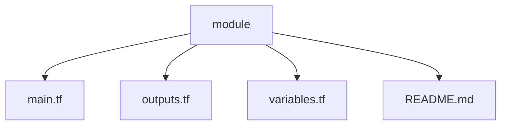
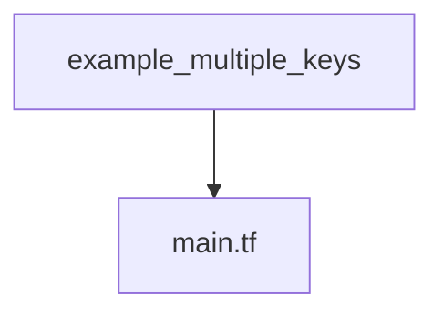

## Introduction 

This repository hosts customized terraform code for creating [AWS SSO](https://docs.aws.amazon.com/singlesignon/latest/userguide/what-is.html) group assignments and permission sets.

The repository is wrapper around [AWS terraform module](https://registry.terraform.io/providers/hashicorp/aws/latest/docs/resources/ssoadmin_managed_policy_attachment). 

## Concepts 

1. ### Permission sets
     A permission set is a template that you create and maintain that defines a collection of one or more IAM policies. Permission sets simplify the assignment of AWS account access for users and groups in your organization. For example, you can create a Database Admin permission set that includes policies for administering AWS RDS, DynamoDB, and Aurora services, and use that single permission set to grant access to a list of target AWS accounts within your AWS Organization for your database administrators.

2. ### Group assignments
   Refers to assigning SSO groups to individual AWS accounts.

## Limitations 
AWS SSO API is not yet capable of programatically creating SSO users and groups. This means team mainitaing AWS SSO is responsible for creating SSO users and groups directly in AWS console. 

## Repository structure 

This repository contains terraform module that can be re-used as needed and an example usage of the module. Two folders of key importance are as follows:

1. modules - Houses terraform module for creating AWS SSO permission sets and group assignments.

1.  example - A simple example demonstrating the use of terraform module to AWS SSO resources. 
 

<!-- BEGIN_TF_DOCS -->
## Requirements

No requirements.

## Providers

| Name | Version |
|------|---------|
|  [aws](#provider\_aws) | n/a |

## Modules

No modules.

## Resources

| Name | Type |
|------|------|
| [aws_ssoadmin_account_assignment.infra_shared_dev](https://registry.terraform.io/providers/hashicorp/aws/latest/docs/resources/ssoadmin_account_assignment) | resource |
| [aws_ssoadmin_managed_policy_attachment.delivery_pipelines_policies](https://registry.terraform.io/providers/hashicorp/aws/latest/docs/resources/ssoadmin_managed_policy_attachment) | resource |
| [aws_ssoadmin_permission_set.delivery_pipelines_readonly](https://registry.terraform.io/providers/hashicorp/aws/latest/docs/resources/ssoadmin_permission_set) | resource |
| [aws_identitystore_group.che_sre](https://registry.terraform.io/providers/hashicorp/aws/latest/docs/data-sources/identitystore_group) | data source |
| [aws_organizations_organization.org_che](https://registry.terraform.io/providers/hashicorp/aws/latest/docs/data-sources/organizations_organization) | data source |
| [aws_ssoadmin_instances.control_tower_che](https://registry.terraform.io/providers/hashicorp/aws/latest/docs/data-sources/ssoadmin_instances) | data source |
| [aws_ssoadmin_permission_set.che_admin_access](https://registry.terraform.io/providers/hashicorp/aws/latest/docs/data-sources/ssoadmin_permission_set) | data source |
| [aws_ssoadmin_permission_set.control_tower_readonly](https://registry.terraform.io/providers/hashicorp/aws/latest/docs/data-sources/ssoadmin_permission_set) | data source |

## Inputs

| Name | Description | Type | Default | Required |
|------|-------------|------|---------|:--------:|
|  [sandbox-che](#input\_sandbox-che) | Account id for sandbox account. | `string` | `"123456"` | no |
|  [sandbox-che-1](#input\_sandbox-che-1) | Account id for sandbox account. | `string` | `"78910"` | no |

## Outputs

| Name | Description |
|------|-------------|
|  [aws\_organizations\_organization](#output\_aws\_organizations\_organization) | # Fetches each account in our AWS organization |
|  [aws\_organizations\_organization\_full](#output\_aws\_organizations\_organization\_full) | # Fetches full organization details |
|  [ssoadmin\_instance](#output\_ssoadmin\_instance) | # Outputs SSO INSTANCE Details |
<!-- END_TF_DOCS -->